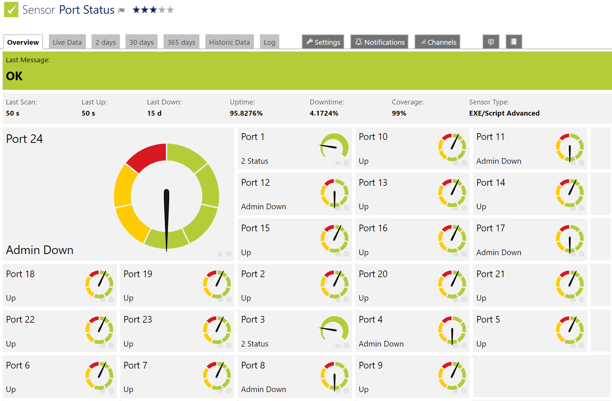

# PRTG-PortStatus

A PRTG script to monitor connection status of network switch ports.

## Discussion
[https://itrandomness.com/2018/02/switch-port-status-monitoring-with-prtg/](https://itrandomness.com/2018/02/switch-port-status-monitoring-with-prtg/)

## Included Scripts
- Switch-PortStatus.ps1 - Monitor connection status of all ports on a switch.  Port will show OK/green if it is up or administratively down.  Port will show error/red if it is down or has errors.

## Configuration
1) Download [SnmpWalk.exe](https://syslogwatcher.com/cmd-tools/snmp-walk/)
	- Copy SnmpWalk.exe to C:\Program Files (x86)\PRTG Network Monitor\Custom Sensors\EXEXML
		- Directory may vary with PRTG install path
2) Create read only SNMP community string on the network swtich.
3) Copy all .ps1 files to C:\Program Files (x86)\PRTG Network Monitor\Custom Sensors\EXEXML
	- Directory may vary with PRTG install path
4) Copy all .ovl files to C:\Program Files (x86)\PRTG Network Monitor\lookups\custom
	- Directory may vary with PRTG install path
5) In PRTG go to Setup > Administrative tools:
	- Reload lookups
	- Restart core server (optional, run if PRTG has issues finding the script)
6) Add a network switch device in PRTG.  Set the hostname or IP to the switch.
7) Edit your network switch device in PRTG and set the SNMP credentials to the new read only community string
8) Add a new EXE/Script Advanced type sensor to your NetScaler device
9) Set the following options on the sensor
	- Name - Set a descriptive name
	- EXE/Script - Choose the desired script
	- Parameters - Enter: -Count- %host %snmpcommunity
		- Note: Replace -Count- with the number of ports on the switch.
10) Select continue

## Screenshots

